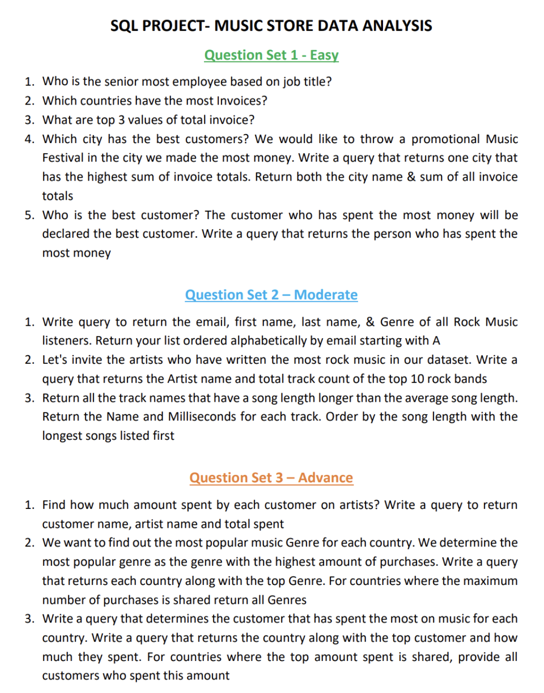

# Musicstore_analysis_sql_project

# 🎵 Music Store Data Analysis (SQL Project)

This project involves analyzing a music store database using **SQL (PostgreSQL)**. The dataset includes tables such as customers, invoices, artists, albums, tracks, and employees.

The goal is to extract meaningful insights like customer behavior, music preferences, and regional trends by writing queries grouped into Easy, Moderate, and Advanced difficulty levels.

---

## 🧰 Tech Stack

- **SQL** (PostgreSQL)
- **pgAdmin** / **VS Code SQL Extension**
- CSV files for mock relational database tables

---

## 🗂️ Project Structure

- `Music_store_database.sql` – SQL dump to create tables  
- `Musicstore_queries_sql.sql` – All the SQL queries used  
- `*.csv` – Data files used to simulate the database  
- `schema_diagram.png` – Database schema  
- `Music_store_project_sql_question.png` – Problem set used  

---

## 🧠 Concepts Used

- `SELECT`, `WHERE`, `ORDER BY`, `GROUP BY`, `HAVING`
- Aggregate functions (`SUM`, `AVG`, `COUNT`)
- Multiple **JOINs**
- Subqueries & nested queries
- String operations and conditional filtering

---

## 🔍 Sample Questions Solved

### 🟢 Easy
1. Who is the senior-most employee?
2. Which countries have the most invoices?
3. Top 3 highest invoice values?
4. Which city has the most valuable customers?
5. Who is the best customer by spending?

### 🟡 Moderate
1. List of rock music listeners (name, email, genre).
2. Top 10 artists with most rock tracks.
3. Songs longer than average duration.

### 🔴 Advanced
1. Total amount spent by each customer on artists.
2. Most popular genre per country based on purchases.
3. Highest-spending customer per country.

---

## 🖼️ Schema Diagram

---

## 📌 Getting Started

To explore the project yourself:

1. Import the `.csv` files into PostgreSQL (or use the `.sql` script).
2. Run the queries from `Musicstore_queries_sql.sql`.
3. Use pgAdmin or any SQL GUI for best visualization.

---

## 📷 Preview

---

## 📬 Contact

For any queries, feel free to reach out via GitHub Issues or Discussions tab.

